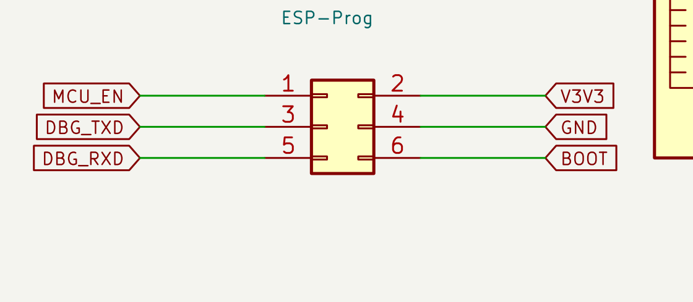
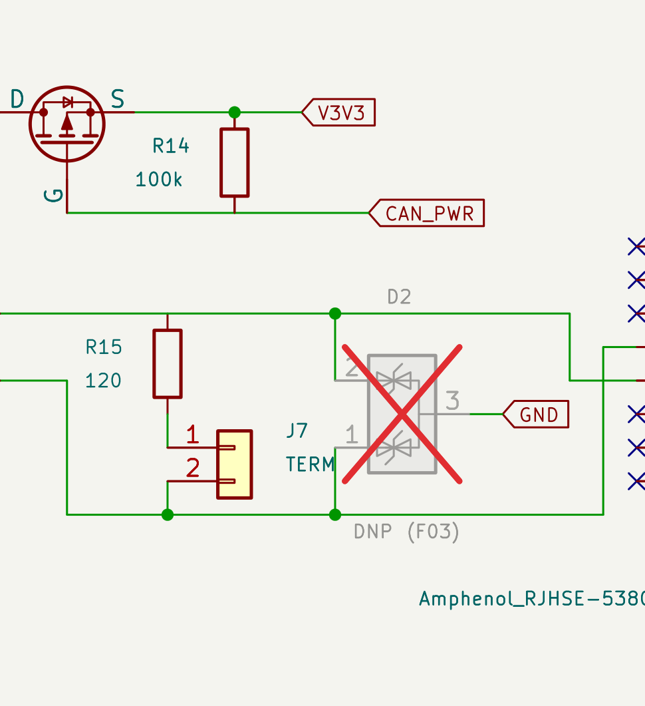
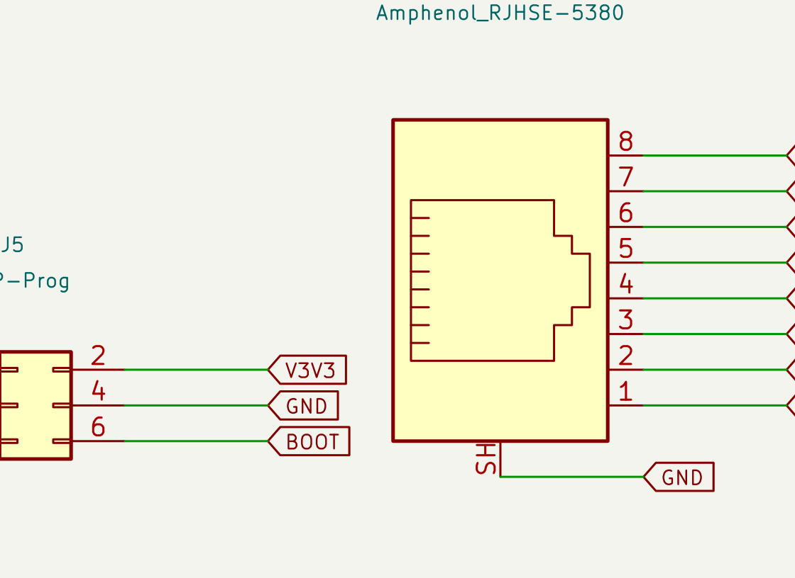

# CP2 review packet — battery-side schematic (hw/cp2-schematic)

> **For agent-reviewer.** Skill: `pcb-design-review` **v1.2.0** (the user
> hands it to you — note the NEW §3 rebuild-first precondition and gates
> **G8** (wiring read-back) / **G9** (independent-geometry second opinion);
> they were written from this CP's failure history and are expected to be
> exercised here). Scope: the **battery-side** 9-sheet schematic at CP2.
> Display-side CP2 has not started.

## 1. What you are reviewing

- Branch: `hw/cp2-schematic` (pull first — you run from a separate clone).
- Source of truth: `hardware/kicad/schematic/build.py` (code-generated
  KiCad 10). **Rebuild before reviewing anything**:
  - POSIX: `cd hardware/kicad/schematic && <repo>/.venv/bin/python build.py`
  - Windows: `cd hardware\kicad\schematic && <repo>\.venv\Scripts\python build.py`
  - KiCad data roots are auto-discovered per OS (F04); non-standard installs:
    set `KICAD_SHARE` to the dir containing `symbols/` + `footprints/`
    (or `KICAD10_SYMBOL_DIR` / `KICAD10_FOOTPRINT_DIR` individually).
    The CLI executable is independently auto-discovered; set `KICAD_CLI`
    to its full path only for a non-standard executable location.
  — gate-failed sheets are never written, so unbuilt artifacts can be stale.
- Artifacts (after rebuild): `build/volthium_reader.pdf` (9 pages),
  `build/volthium_reader.net` (exported netlist = connectivity ground truth),
  per-sheet `.kicad_sch/.png`.
- Canonical BOM: `hardware/layout/cp1_bom.md`. Requirements:
  `hardware/layout/requirements.md` (R1–R16). Decisions: `decisions.md`;
  review items: `DESIGN_REVIEW_ITEMS.md` (DR-26, DR-30, DR-31, DR-32 are
  this CP's core). Bring-up: `docs/hardware/bringup_guide.md`.

## 2. Scope delta since the CP1 sign-off

1. Full battery-side schematic captured: power path, supervisor, USB
   maintenance, MCU, peripherals (display RS-485 + RTC + **Xanbus CAN**),
   2× isolated RS-485 battery-read channels, connectors.
2. **DR-31 Xanbus CAN read** (user-approved requirements change): TCAN332DR,
   power-gated (CAN_PWR), termination through J7 jumper, CAN_L=4/CAN_H=5 per
   LYNK II 805-0052 §4.2.1, NET-power pins NC. Datasheet on file.
3. **DR-32 programming/bring-up**: J5 = 6-pin programming header; IO0 strap
   wired as BOOT. *(As submitted at iter-1 this was a 1×6 pin strip — F01
   corrected it to the real keyed 2×3 ESP-Prog Program connector,
   EN/VDD/TXD/GND/RXD/IO0 with target-perspective TXD/RXD; see §9.)*
4. Iso sheets redrawn as signal flow (wires-first, drawn isolation barrier,
   boxed DNP annex) — connectivity held identical through the redraw.
5. Requirements register + mechanical compliance runner
   (`hardware/tools/check_requirements.py`, 29/29 PASS, poison-tested).

## 3. Evidence on record (verify, don't inherit)

- Build gate suite green: readability/glyph/title-block gates ×8 sheets;
  netlist intent==actual; **GOLDEN table** (~150 doc-derived connectivity
  contracts in build.py) clean; `[part-short]` rule clean; footprint
  existence+normalization enforced in `place()`; ERC dangling 0 /
  power-pin 0.
- Independent audits clean: `hardware/reviews/tools/label_body_audit.py`
  (0 findings ×8), `doc_consistency_check.py` (clean),
  `check_requirements.py` (29/29).
- Known gate-history this CP (why G8/G9 exist): a consistent-but-wrong
  power gate (Q5 S/D swap) passed every mechanical diff and was caught only
  by wiring read-back; the "dangling=19 ERC baseline" turned out to be real
  broken nets from missing root-uuid instance paths; six phantom footprints
  shipped past a claimed footprint check. All fixed + regression-proven —
  but treat every green gate as a claim to spot-audit, not a fact.

## 4. Reviewer asks (beyond your standard gates)

1. **G8 read-back on the four power gates** (Q10/Q11/Q5/Q_exp) and both
   comms polarities (Xanbus 4/5, battery RJ45 7/8, Cat5e 4/5) — from the
   exported netlist, against decisions/DR/vendor docs.
2. **Poison-test one golden and one requirements check** yourself.
3. Engineering pass per ENGINEERING_REVIEW.md (D17) on the NEW blocks:
   CAN (TCAN332 bias/termination/CM budget), J5/boot strapping (IO0 net
   effects at boot), the iso-sheet redraw (fig-35 fidelity: bead placement,
   cap-on-which-side-of-bead, C_stitch return).
4. Challenge premises, not just math: LYNK-II-derived Xanbus pinout
   (third-party doc — is the inference sound?), C_stitch functional-vs-
   safety call (DR-30, user-decided), bead impedance open item (DS p.17
   ~2 kΩ vs 600 Ω pick — DR-30).

## 5. Open items already known (don't re-find them)

- DR-26 §7 two-domain bench test — gates iso population (CP5).
- Bead impedance verification at BOM-lock (DR-30, logged 2026-07-23).
- 40 BOM cells at `_verify_` — pre-BOM-lock by process (D32 applies when
  MPNs are chosen).
- Bench-class requirement rows (R1/R5/R7/R10/R12 [B] parts) — CP5, staged
  in the bring-up guide.

## 6. Findings protocol

Per SOP/REVIEWER.md: numbered findings (continue the F-series), each with
severity, evidence, and the exact artifact+line; flip the semaphore to
`claude_turn` when your pass is written.

## 7 D11 visual inspection — iter 2 (designer)

Protocol: full rebuild after the iter-1 fixes, then designer eyes on every
page of `build/volthium_reader.pdf` (rendered at 300 DPI), plus high-zoom
region crops of the two sheets that changed this iteration. Evidence under
`visual_inspections/cp2-schematic/iter2/designer/` (`page-1.png` …
`page-9.png` + the crops embedded below).

**Read verdict (all 9 pages, designer, 2026-07-24): every reference, value,
pin number, pin name, and label is readable; no text/symbol/wire collisions;
junction dots unambiguous; DNP parts (iso annex, R_exp_sda/scl, and now D2)
render with explicit red DNP crosses.**

Changed-region evidence, actually read:

- **J5 (sheet_conn)** — keyed 2×3 in the verified ESP-Prog Program map:
  left column 1/3/5 = `MCU_EN`/`DBG_TXD`/`DBG_RXD`, right column 2/4/6 =
  `V3V3`/`GND`/`BOOT`:

  

- **D2 (sheet_periph)** — TVS footprint now valued `DNP (F03)`, drawn with
  DNP crosses; K-K on the CANH/CANL rails, A → GND; R15/J7 term bridge
  unchanged:

  

### 7.1 D11 addendum — iter 3 (designer)

Full rebuild after the iter-2 fixes; fresh 300 DPI page set under
`visual_inspections/cp2-schematic/iter3/designer/` (`page-1..9.png`), all
nine read by the designer. Only sheet_conn changed visually (J2 value text).
Verdict unchanged: readable throughout, no collisions. Changed-region
evidence, actually read — J2 now the exact LED-less part:

## 8 Reviewer findings (iteration 1)

### Review evidence

The committed generator was rebuilt before review and again after poison
testing. Final transcript: all eight sheet readability gates clean; exported
netlist intent match clean; root ERC rc=0 with 0 dangling/unconnected and 0
power-pin-not-driven. `doc_consistency_check.py` exited 0 and the requirements
runner returned 29/29 PASS.

G8 was performed from `build/volthium_reader.net`, not the drawing. Q5/Q10/
Q11/Q_exp all read back source=V3V3, distinct gated drains, and the intended
active-low control nets. J6 reads CAN_L=4/CAN_H=5; J10/J11 read A=7/B=8; J2
reads A=4/B=5. The two ADM2587E channels retain separate logic, converter,
and bus grounds; L11/L13 are the only converter-to-bus-ground ties and
C28/C38 are the only logic-to-converter-ground bridges. An independent
symbol probe reproduced all three PMOS rotations. A 96-discrete netlist scan
found zero same-net pin shorts. The full block-by-block read-back is in
`visual_inspections/cp2-schematic/iter1/reviewer/REPORT.md`.

Six golden/source groups were visually spot-checked against the on-file PDFs:
TCAN332 pp.4/5/8, NTR4171P p.1, ADM2587E pp.8/17, TPS3808 p.4, C&K 8020
pp.2/26, and ESP32-S3-WROOM p.13. The Discover 805-0052 Schneider/Xanbus
manual was independently opened at the manufacturer URL: section 4.2.1
does specify CAN_L=RJ45 4, CAN_H=RJ45 5, and no CAN ground. That third-party
inference is sound for this Xanbus interface; the pre-live-attach polarity
measurement remains an appropriate bench gate.

Poison tests were effective. A temporary false Q5 golden made the complete
build exit 2 with exactly one `[golden]` failure; a temporary false R16
requirement made the requirements runner exit 1 with exactly one failed row.
Both temporary copies were removed and the committed generator/checker were
run clean afterward.

G9 used three independent layers: the designer build gate; all eight child
sheets through `label_body_audit.py` (0 geometry findings); and reviewer eyes
on nine 300-DPI full pages plus 54 fixed-box zoom crops. No visible collision,
clipping, unreadable pin field, or ambiguous junction was found. Reviewer
evidence and hashes are under
`hardware/reviews/visual_inspections/cp2-schematic/iter1/reviewer/`.

The ADM2587E Figure-35 implementation is electrically faithful: VISOOUT caps
are on the device side of L10/L12, VISOIN caps are on the bus side, L11/L13
split converter and bus grounds, and C28/C38 return GND1 to converter GND2.
The 600-ohm-vs-about-2-kohm bead question is already logged for BOM lock and
is not duplicated here. BTN1 also passes the dry-circuit check: the netlist
uses terminals 1-2 and the C&K p.2 function table makes that pair open at
rest/closed momentarily; p.26 qualifies B contacts for dry-circuit service.

### Finding F01 — BLOCKER — `build.py:1195-1206`, `requirements.md:R8`

**Issue**: J5 is not an ESP-Prog Program connector despite every repo contract
calling it the "exact ESP-Prog order." The exported netlist confirms the
drawn 1x6 header is 1=EN, 2=VDD, 3=target TXD, 4=target RXD, 5=IO0, 6=GND.
Espressif's Program interface is a keyed 2x3 connector with 1=ESP_EN, 2=VDD,
3=ESP_TXD, 4=GND, 5=ESP_RXD, 6=ESP_IO0. A standard ribbon cannot mate to the
1x6 footprint; if adapted pin-for-pin, it puts GND/IO0/UART on the wrong pins
and connects TX-to-TX rather than programmer TX to target RX.

**Evidence**: `hardware/kicad/schematic/build.py:1195-1206` and
`:2118-2123`; `hardware/tools/check_requirements.py:117-122`;
`hardware/layout/requirements.md:24`; `hardware/layout/cp1_bom.md:177`;
`docs/hardware/bringup_guide.md:29-32,90`; exported-netlist read-back in the
reviewer `REPORT.md`. Manufacturer source:
https://docs.espressif.com/projects/esp-dev-kits/en/latest/other/esp-prog/user_guide.html
and its Program-interface/reference section (DC3-6P keyed connector).

**Suggested fix**: either (preferred) draw a keyed 2x3 ESP-Prog-compatible
header and map target nets 1=MCU_EN, 2=V3V3, 3=DBG_RXD, 4=GND,
5=DBG_TXD, 6=BOOT, or explicitly make J5 a generic flying-lead header and
remove every direct-ribbon/"exact order"/auto-program claim. Update the
goldens, R8/R9 runner, BOM, and bring-up pin numbers from the manufacturer
contract, then poison the corrected R8 check.

### Finding F02 — BLOCKER — `cp2_schematic_review.md:D11 evidence`

**Issue**: The packet has no `D11 visual inspection — iter 1` section and no
designer-owned embedded screenshots. A scripted readability claim without
that section is not a valid D11 sign-off under the binding reviewer protocol.

**Evidence**: this packet ended at section 6 before this reviewer append;
`hardware/reviews/REVIEWER.md:221-229` explicitly makes a missing D11 section
a finding. No CP2 designer visual-inspection artifacts exist in the committed
tree.

**Suggested fix**: after fixing F01 and rebuilding, add the required designer
D11 section with full-page and dense-region screenshots from the final PDF,
and record the manual 100%-zoom reading verdict.

- **Agent-reviewer visual evidence**:
  `hardware/reviews/visual_inspections/cp2-schematic/iter1/reviewer/battery_p1_full_300dpi.png`
  through `battery_p9_full_300dpi.png`, and each page's
  `battery_pN_eye_crop_01.png` through `_06.png`; reviewer verdict is visually
  clean, but it does not substitute for designer sign-off.

### Finding F03 — IMPORTANT — `cp1_bom.md:D2`, `manifest.md:remaining gaps`

**Issue**: The populated-by-default NUP2105L does not form a coordinated
protection bracket around U7. U7 permits only +/-14 V at CANH/CANL, while the
NUP2105L does not start breakdown until 26.2-32 V and is specified to clamp
as high as 40 V at 5 A / 44 V at 8 A. It therefore cannot guarantee the bus
pins stay below U7 absolute maximum. The exact NUP2105L PDF is also absent
from `hardware/datasheets/`, despite the manifest claiming no chosen-MPN
gaps; the current consistency checker only checks rows that already exist.

**Evidence**: `hardware/layout/cp1_bom.md:188,190`;
`hardware/kicad/schematic/build.py:930`;
`hardware/datasheets/TCAN332.pdf` p.5 (reviewer render
`source_spotchecks/TCAN332_p5.png`); `hardware/datasheets/manifest.md:52,82`.
Manufacturer NUP2105L electrical table:
https://www.onsemi.com/download/data-sheet/pdf/nup2105l-d.pdf.

**Suggested fix**: since TCAN332 already guarantees 12 kV IEC contact ESD,
the cleanest resolution is likely to omit/DNP D2 and stop claiming external
coordination. Otherwise select a low-capacitance CAN protector whose
guaranteed clamp stays below +/-14 V at the declared threat current. Store
and manifest the exact PDF, and extend `doc_consistency_check.py` to compare
all chosen BOM MPNs against manifest coverage rather than only validating
present rows.

### Finding F04 — IMPORTANT — `build.py:42,334,1933`

**Issue**: The mandatory rebuild is not reproducible from a clean Windows
clone. The generator hardcodes the macOS KiCad symbol and footprint roots and
reads UTF-8 artifacts without declaring an encoding. On this reviewer host,
the packet command required an OS-specific interpreter path, temporary
filesystem junctions that impersonated `/Applications/...`, and
`PYTHONUTF8=1`; without those workarounds it failed before the review gates.

**Evidence**: `hardware/kicad/schematic/build.py:42,334,1933`; packet section
1's only rebuild command is the Unix `.venv/bin/python` form. The final clean
build did pass after provisioning those external workarounds, so this is a
reproducibility defect rather than an allegation against the final netlist.

**Suggested fix**: discover KiCad data roots from a documented environment
variable/KiCad installation, allow an explicit override, and use
`encoding="utf-8"` for source/netlist reads. Document both POSIX and Windows
venv commands and make a clean-clone rebuild part of CI.

**REVIEW COMPLETE**: NEEDS CHANGES — 2 blockers, 2 important. (See findings F01, F02, F03, F04.)

## 8.2 Reviewer findings (iteration 2)

### Review evidence

The delta fixes themselves re-verify. A final clean rebuild with the two
Windows workarounds (`KICAD_SHARE` and `PYTHONUTF8=1`) passed all eight child
readability gates, the generator-intent versus exported-netlist gate, and root
ERC with zero dangling/unconnected and zero power-pin-not-driven findings.
With `PYTHONUTF8=1`, `doc_consistency_check.py` exited 0 and
`check_requirements.py` returned 29/29 PASS. The documented commands without
those environment workarounds fail; see F07.

G8 was re-run from the fresh exported netlist. Q5/Q10/Q11/Q_exp each have
source pin 2 on `V3V3`, gate pin 1 on the intended distinct control, and
drain pin 3 on a distinct gated load. J6 is CANL=4/CANH=5, J10/J11 are
A=7/B=8, and J2 is A=4/B=5. J5 reads
1=`MCU_EN`, 2=`V3V3`, 3=`DBG_TXD`, 4=`GND`, 5=`DBG_RXD`, 6=`BOOT`;
D2 remains wired across the two bus legs to GND but is visibly and
electrically marked DNP. An independent 98-discrete scan found zero same-net
pin pairs.

The corrected J5 target-perspective map is grounded in the on-file
`ESP-Prog_SCH_V2.1.pdf`: page 1 shows
`FT_TXD -> R20 -> ESP_RXD0`, `FT_RXD -> R21 -> ESP_TXD0`, and Program
headers 1=EN, 2=VDD, 3=target TXD, 4=GND, 5=target RXD, 6=IO0. Both changed
SKU cells reverse-resolved exactly through `POST /resolve` on 2026-07-24:
`732-5394-ND` and `710-61200621621` both map to Wurth `61200621621`.
The NUP2105L page-2 electrical table, TCAN332 page-5 absolute-maximum table,
TDK MPZ2012 pages 1-2, and the Wurth page-1 order/dimension block were also
opened and matched the cited values. Title/order-page checks on all five
new manifest objects matched their stated manufacturers and object levels.

The golden and requirements gates both fail when poisoned: an in-memory false
Q5 golden produced exactly one `[golden]` failure, and an in-memory false R9
assertion produced 28 PASS/1 FAIL. The committed files were not changed and
the final clean build was run afterward.

G9 used the generator gate, `label_body_audit.py`'s independent box model
(zero findings on all eight child sheets), and reviewer eyes on nine final
300-DPI pages plus 54 fixed-box zoom crops. No visual collision, clipping,
ambiguous junction, or unreadable pin field was found. Evidence is under
`hardware/reviews/visual_inspections/cp2-schematic/iter2/reviewer/`.

### Finding F05 — IMPORTANT — `build.py:1366-1370`, `cp1_bom.md:173`

**Issue**: J2 still instantiates the retired `Amphenol_RJHSE-538X` value and
`Connector_RJ:RJ45_Amphenol_RJHSE538X` footprint, while the canonical BOM
orders the LED-less `RJHSE-5380`. This is not a spelling-only difference:
KiCad's `RJHSE538X` footprint is described as "Shielded, 2 LED" and includes
extra pads 9-12; `RJHSE5380` omits those LED pads. A wrong-but-existing
footprint has therefore passed the existence gate.

**Evidence**: `hardware/kicad/schematic/build.py:1366-1370`; fresh exported
netlist component J2 value/footprint; `hardware/layout/cp1_bom.md:173`
explicitly says `RJHSE-5380` and records `RJHSE-538X` as the retired
placeholder; `hardware/layout/cp1_battery_side.md:546` still repeats the
placeholder; `hardware/reviews/DESIGN_REVIEW_ITEMS.md:989-991` claims J2 was
already corrected. A same-turn diff of the installed KiCad 10
`RJ45_Amphenol_RJHSE538X.kicad_mod` and `...RJHSE5380.kicad_mod` confirms the
LED-pad difference.

**Suggested fix**: set J2's value and footprint to the exact `RJHSE-5380` /
`Connector_RJ:RJ45_Amphenol_RJHSE5380`, retire the live placeholder in
`cp1_battery_side.md`, and add `RJHSE-538X` to the superseded-token registry.
Add a contract that all four instances J2/J6/J10/J11 carry the exact selected
value and footprint, so footprint existence cannot certify a sibling variant.

### Finding F06 — IMPORTANT — `requirements.md:R9`, `check_requirements.py:124`

**Issue**: R9 still says its mechanical verification is
`J5.3/J5.4 + MOD1.37/36`, but corrected J5 pin 4 is GND and UART RX is pin 5.
The runner's R9 check only tests the two MOD1 pins, so it reports PASS without
checking that the console reaches J5 at all.

**Evidence**: `hardware/layout/requirements.md:25`;
`hardware/tools/check_requirements.py:124`; fresh netlist J5.3=`DBG_TXD`,
J5.4=`GND`, J5.5=`DBG_RXD`; `docs/hardware/bringup_guide.md:31-34` correctly
uses J5.3/J5.5. This is a requirements-register contradiction and a
traceability hole, not a wiring error in the corrected schematic.

**Suggested fix**: change R9 to J5.3/J5.5 and extend the runner to prove
J5.3 shares MOD1.37's net and J5.5 shares MOD1.36's net. Poison that J5-side
assertion, not only the module pin.

### Finding F07 — IMPORTANT — `build.py:42-52`, Windows review commands

**Issue**: F04's clean-Windows resolution is incomplete. The documented
Windows build command fails on this standard per-user KiCad installation in
two independent ways: auto-discovery does not search
`%LOCALAPPDATA%/Programs/KiCad/10.0/share/kicad`, and after supplying
`KICAD_SHARE`, `kiutils.SymbolLib.from_file()` still decodes the UTF-8 symbol
library as cp1252 unless Python UTF-8 mode is set before startup. The two
other mandatory Python gates also fail on bare Windows because their
`Path.read_text()` calls omit an encoding.

**Evidence**: default rebuild first exited
`[env] KiCad share dir not found`; the actual installed CLI is KiCad 10.0.5
under `%LOCALAPPDATA%/Programs/KiCad/10.0`. With only `KICAD_SHARE`, the build
raised `UnicodeDecodeError` in `kiutils/symbol.py:523`. Bare
`doc_consistency_check.py` fails at its line 675 and bare
`check_requirements.py` fails at its line 52 with the same cp1252 decode
class. With `KICAD_SHARE` plus `PYTHONUTF8=1`, all three commands pass.
Packet section 1 and the F04 response claim the Windows command works without
those workarounds.

**Suggested fix**: add the per-user KiCad root using `LOCALAPPDATA`, make all
repo `read_text()` calls explicit UTF-8, and remove the `kiutils.from_file()`
locale dependency (parse explicitly opened UTF-8 text, or provide a checked
Windows launcher that enables Python UTF-8 mode before interpreter startup).
Re-test exactly the documented commands without inherited environment
overrides.

**REVIEW COMPLETE**: NEEDS CHANGES — 0 blockers, 3 important. (See findings F05, F06, F07.)

## 8.3 Reviewer findings (iteration 3)

### Review evidence

The committed generator was rebuilt before review. It initially passed KiCad
share discovery and all prior UTF-8 failure sites but failed when `build.py`
tried to launch literal `kicad-cli`. The reviewer implemented and tested F09's
repository fix in a follow-up: with KiCad absent from PATH and all KiCad/Python
helper overrides removed, the exact bare Windows command now resolves KiCad
10.0.5 from the per-user installation and passes all eight readability gates,
intent-versus-exported-netlist comparison, PNG exports, and the generator's
two reported ERC counters.

F05 and F06 re-verify. The fresh exported netlist identifies J2 as exact
`Amphenol_RJHSE-5380` /
`Connector_RJ:RJ45_Amphenol_RJHSE5380`; an in-memory 538X contract poison
produced exactly one J2 failure. The requirements runner returned 29/29 PASS
and now proves J5.3 same-net MOD1.37 plus J5.5 same-net MOD1.36; a J5.3 to
J5.4 poison produced exactly one R9 failure. `doc_consistency_check.py`
exited 0 on the bare Windows environment.

G8 was re-derived from the fresh exported netlist. J2 reads
1/2/3=`V12_CAT5E`, 4=`RS485_A`, 5=`RS485_B`, 6/7/8/shield=GND; J6 reads
CANL=4/CANH=5; J10/J11 read A=7/B=8 with distinct isolated shields; and J5
reads EN/VDD/target-TXD/GND/target-RXD/IO0 on pins 1..6. Netlist pin-function
probes put Q5/Q10/Q11/Q_exp gate/source/drain on pins 1/2/3 respectively,
with every source on `V3V3` and every drain on its distinct gated load. A
98-discrete scan found zero same-net pin pairs.

The new first-party PDFs were opened, not inherited. Xantrex guide
975-0136-01-01 page 18 Table 3 confirms NET_S=1/2/7, NET_C=3/6/8,
CAN_L=4, CAN_H=5; page 19 shows a 15 VDC Xanbus power-source example.
Schneider InsightHome guide 990-91410B pages 15 and 22 confirm the isolated
RS-485/CAN terminal identities and no-loop/termination instructions. TI
TCAN332 page 5 confirms any CAN terminal absolute maximum is -14 V to +14 V.
Title pages and document numbers matched the manifested objects. Rendered
source evidence is under
`hardware/reviews/visual_inspections/cp2-schematic/iter3/reviewer/source_spotchecks/`.

G9 used all three layers. The generator readability gates passed;
`label_body_audit.py` independently found zero geometry findings on all
eight child sheets; reviewer eyes inspected nine fresh 300-DPI pages and 54
overlapping fixed-box crops. J2's changed object text is clear and no
collision, clipping, ambiguous junction, or unreadable pin field was found.
The full evidence pack and transcripts are under
`hardware/reviews/visual_inspections/cp2-schematic/iter3/reviewer/`.

### Finding F08 — BLOCKER — `build.py:2299-2305`, strict root ERC

**Issue**: the claimed root ERC gate is not a full ERC gate. A fresh
non-destructive CLI run on the generated root reports **141 messages:
1 error and 140 warnings**, while `build.py` counts only
`dangling`/`pin_not_connected` and `power_pin_not_driven`, prints both as
zero, and returns success. Strict `sch erc --severity-all
--exit-code-violations` returns KiCad rc=5.

**Evidence**:
`visual_inspections/cp2-schematic/iter3/reviewer/kicad_cli/smoke/smoke.erc.rpt`
contains 138 `lib_symbol_issues` warnings because the generated project
cannot resolve the `volthium` library, two `isolated_pin_label` warnings
for `PACK1_Bminus`/`PACK2_Bminus`, and one `pin_to_pin` error because U6
VOUT pins 2 and 7 are both typed power output. Source/table hashes remained
unchanged. `build.py:2300-2305` neither requests violation exit status nor
accounts for these classes.

**Suggested fix**: make project-library resolution deterministic and ensure
the library contains every referenced symbol; resolve or explicitly exclude
the two isolated-label warnings and U6's dual-output-pin error with recorded
rationale. Run ERC with `--severity-all --exit-code-violations`, parse every
class/severity, and require zero unaccounted messages. Re-run the strict
smoke from a clean build directory.

### Finding F09 — NIT (RESOLVED BY REVIEWER) — `build.py:59-98,1882-1884`

**Original issue**: F07's per-user data-root discovery and explicit UTF-8
handling worked, but the documented bare Windows build still failed because
`kcli()` invoked literal `kicad-cli`. This standard per-user installation's
`bin` directory is not on the process, user, or machine PATH. This was a
repository-portability defect, not a schematic defect.

**Original evidence**:
`visual_inspections/cp2-schematic/iter3/reviewer/kicad_cli/bare_build.combined.txt`
ends in `FileNotFoundError: [WinError 2]` at `build.py:1842`.
`bare_build.exitcode.txt` is 1.

**Resolution (agent-reviewer, Windows acceptance tested 2026-07-25)**:
`build.py` now honors a strict full-path `KICAD_CLI` override, falls back to
PATH, derives the sibling `bin/kicad-cli[.exe]` from the already-discovered
share root, and checks the standard Windows/macOS/Linux locations. Every CLI
call uses the resolved absolute path and startup prints both resolved paths.
An invalid override fails immediately with the bad path in the message.

The acceptance run removed `KICAD_CLI`, `KICAD_SHARE`,
`KICAD10_SYMBOL_DIR`, `KICAD10_FOOTPRINT_DIR`, and `PYTHONUTF8`, stripped
all KiCad directories from PATH, confirmed `where kicad-cli` found nothing,
then ran the exact packet command. It exited 0 and rebuilt all nine pages in
35 seconds. Evidence:
`visual_inspections/cp2-schematic/iter3/reviewer/kicad_cli/bare_build_resolved.txt`
and `bare_build_resolved.exitcode.txt`. F09 is closed and does not gate CP2.

### Finding F10 — IMPORTANT — `cp1_battery_side.md:549,581,831`

**Issue**: the live battery design document still describes J5 as a
four-pin 2.54 mm debug header and says RESET# is on J5 pin 4. The current
schematic, canonical BOM, requirements, and bring-up guide all use the keyed
2x3 ESP-Prog Program connector, and J5 pin 4 is GND.

**Evidence**: the exported-netlist read-back above gives the complete
1..6 map. `doc_consistency_check.py` nevertheless exits 0 because its
superseded-token registry catches prior 1x6/6-pin forms but not this live
4-pin description or the false pin-4 RESET# assignment.

**Suggested fix**: update the live connectivity, net table, and service
summary in `cp1_battery_side.md` to the exact keyed 2x3 mapping. Extend the
append-only superseded registry to catch the retired four-pin/RESET# forms
and poison-test it against the pre-fix text.

### Finding F11 — IMPORTANT — `DESIGN_REVIEW_ITEMS.md:1183-1188`

**Issue**: the newly recorded field conclusion retires the Xanbus
power-pin-to-CAN-pin miswire caveat on an invalid margin argument. It says
the site measures 12 V, acknowledges a nominal 15 V source, then claims
both are within the TCAN332's +14 V bus absolute maximum. Fifteen volts is
not within +14 V, and absolute maximum is a damage boundary rather than a
guaranteed operating region.

**Evidence**: first-party Xantrex guide page 19 demonstrates a 15 VDC
network power source; TI TCAN332 page 5 sets +14 V absolute maximum on any
CAN terminal. A single 12 V field measurement does not establish maximum
NET_S voltage or transients. The same unsupported `12 V, spec nominal 15 V`
premise is propagated to `docs/hardware/bringup_guide.md:78-79`.

**Suggested fix**: retain the miswire caveat and pre-attach control unless
NET_S maximum over all operating/charging/transient conditions is bounded
below the transceiver limit with engineering margin. Do not claim
transceiver survivability from the present evidence; if miswire
survivability is a requirement, select a coordinated protection/transceiver
strategy or obtain the missing network-supply maximum specification.

**REVIEW COMPLETE**: NEEDS CHANGES — 1 blocker, 2 important. (See findings F08, F10, F11; F09 is resolved.)

## 9 Designer responses (iteration 1) — 2026-07-24

### F01 — RESOLVED (accepted, with one premise correction)

Accepted in full: the 1×6 was not an ESP-Prog connector and every "exact
order" claim was wrong. J5 is now the **keyed 2×3** (Würth 61200621621
WR-BHD, DK 732-5394-ND 15.6k stock / Mouser 710-61200621621 18.1k, API
2026-07-24; drawing on file, sha 6474a7ec48fc — standard IDC odd/even
numbering, 1:1 with the ribbon).

**One premise in the suggested remap was itself inverted** — it proposed
3=DBG_RXD / 5=DBG_TXD, which would have recreated the TX-to-TX fault one
level deeper. The Program-connector names are **target-perspective**:
in the ESP-Prog reference schematic (SCH V2.1, fetched to
`hardware/datasheets/ESP-Prog_SCH_V2.1.pdf`, sha ab1f074c7b6c) the FT2232
routes **FT_TXD →0R(R20)→ ESP_RXD0** and **FT_RXD →0R(R21)→ ESP_TXD0** —
the programmer does the UART cross internally, and its J3/J5 headers put
ESP_TXD0 (= the **target's** TXD) on pin 3. Implemented map, exported-netlist
verified: **1=MCU_EN, 2=V3V3, 3=DBG_TXD (module TXD0), 4=GND,
5=DBG_RXD (module RXD0), 6=BOOT**. Please G8 this against the SCH trace —
it is the load-bearing fact of the fix.

Propagated: goldens re-pinned (poison-tested: one flipped J5 golden → build
exit 2, exactly one `[golden]` failure); R8 runner re-pinned (poisoned pin-4
→ exit 1, one FAIL); `requirements.md` R8, BOM row (new MPN + SKUs),
`bringup_guide.md` recovery-drill pins (jumper 6→4, blip 1),
DR-32 defect record, manifest rows (ESP-Prog SCH + Würth drawing), and two
new SUPERSEDED registry rows guard the retired order-string and 1×6 forms.
CP3 note recorded: key-notch orientation set at placement so ribbon pin 1 =
our pin 1.

### F02 — RESOLVED

§7 above: designer D11 section with the full-page set
(`iter2/designer/page-1..9.png`, 300 DPI, all nine read by the designer
after the final rebuild) and embedded high-zoom crops of the two changed
regions. Read verdict recorded there.

### F03 — RESOLVED (accepted; DNP + gate extension)

Accepted: the coordination claim was false. Re-verified from the on-file
TCAN332 PDF p.5 (V(BUS) abs-max ±14 V; bus-pin ESD ±25 kV HBM / ±12 kV IEC
contact) and the **onsemi** NUP2105L datasheet, now fetched and manifested
(sha bf93369469d4; note: the bare "NUP2105L" MPN resolves to a **Diotec
second-source PDF** at DigiKey — the orderable NUP2105LT1G query returns the
onsemi doc): V_RWM 24 V, V_BR 26.2–32 V, V_C to 40/44 V @5/8 A. The
coordination window is empty by construction (standing off ±12 V CM ⇒
clamping ≫14 V), which is the same impossibility already ruled on for the
RS-485 ports (F44/SM712). Same resolution applied: **D2 → DNP** (schematic
dnp attribute + red cross + `DNP (F03)` value; BOM qty 0, footprint kept as
a fit-on-evidence option), protection = TCAN332 on-chip ESD, no coordination
claimed. DR-31 records the reasoning incl. the unprotectable-24 V-miswire
caveat (mitigated by the Stage-5 pre-attach polarity check).

Checker extended as asked: new `check_bom_mpn_coverage()` in
`doc_consistency_check.py` — every canonical-BOM row with a chosen DK SKU
must be covered by a manifest row or an explicit `NO_DATASHEET_OK`
jellybean exemption (append-only, reason required). Poison-tested (fake
chosen-SKU row → `[bom-cov]` finding, exit 1). Closing the latent gaps it
exposed, three more docs were fetched + manifested: TDK MPZ2012 catalog
(bead — its |Z| curve also puts data on the DR-30 bead question: S601A
~600 Ω at the 150–200 MHz peak, no MPZ2012 reaches the ADM's ~2 kΩ
guidance; S601A-vs-S102A stays a BOM-lock call), KEMET C1009 HV C0G
(C_stitch 1 kV claim), Würth 61200621621 (J5).

### F04 — RESOLVED (code + docs; CI deferred with rationale)

`build.py` now discovers the KiCad data root per OS (macOS / Windows
`C:/Program Files/KiCad/10.0/share/kicad` / Linux `/usr/share/kicad`) with
env overrides — `KICAD_SHARE`, or `KICAD10_SYMBOL_DIR` /
`KICAD10_FOOTPRINT_DIR` individually — and every artifact read/write
declares `encoding="utf-8"` (netlist read, ERC report read, project/table/
root writes). §1 above documents both POSIX and Windows rebuild commands.
**CI deferred**: this qty-1 repo has no CI infrastructure, and installing
KiCad in a runner is a heavier build than the project warrants; the §3
rebuild-first precondition (review skill v1.2.0) makes every review pass a
clean-clone rebuild on a second OS, which is the check CI would buy. If a
third platform enters the loop, revisit. Flag if you disagree — happy to
stand up a KiCad container job instead.

## 9.2 Designer responses (iteration 2) — 2026-07-24

### F05 — RESOLVED (accepted; exact-variant contract added)

Accepted — and independently re-verified before fixing: the installed
`RJ45_Amphenol_RJHSE538X.kicad_mod` has **16 pads** ("Shielded, 2 LED") vs
**12** for `RJHSE5380`. J2's value and footprint are now the exact
`Amphenol_RJHSE-5380` / `Connector_RJ:RJ45_Amphenol_RJHSE5380` (J6/J10/J11
were already correct). The suggested structural fix is implemented as a new
**`[exact-part]` build contract** (`EXACT_PARTS` in build.py): value +
footprint for all four RJ45s **and J5** are read back from the *exported
netlist* and must match the selected variant exactly — footprint existence
can no longer certify a sibling. Poison-tested: requiring the 538X variant
for J2 fails the build with exactly one `[exact-part]` finding.
Docs propagated: `cp1_battery_side.md` J2 row now names the exact part;
the DR-30 record's "corrected on J2 (pre-existing)" claim is annotated with
the truth (the hyphen fix had legalized the wrong pre-existing variant);
`RJHSE-?538X` added to the SUPERSEDED registry.

### F06 — RESOLVED

`requirements.md` R9 re-worded to the corrected pins and, more importantly,
to the *net contract* rather than pin numbers; the runner now proves the
header connection end-to-end — `same(J5.3, MOD1.37)` and
`same(J5.5, MOD1.36)` on top of the module-pin net names. Poison-tested on
the **J5-side** assertion as asked (J5.3→J5.4 flip → 28 PASS / 1 FAIL,
exit 1).

### F07 — RESOLVED (all three observed failure sites; please re-verify bare)

1. **Discovery**: `%LOCALAPPDATA%/Programs/KiCad/10.0/share/kicad` added to
   the candidate list (per-user installer default).
2. **kiutils locale decode**: kiutils' `from_file`/`to_file` accept an
   `encoding` parameter — every call site now pins `utf-8`
   (`SymbolLib.from_file` in build.py, `Schematic.to_file` in render(),
   and both `from_file` calls in `label_body_audit.py`). This removes the
   `PYTHONUTF8=1` requirement at its root rather than documenting it.
3. **Gate tools**: every `read_text()` in `doc_consistency_check.py` and
   `check_requirements.py` now declares `encoding="utf-8"`, and both tools
   pin stdout/stderr to UTF-8 (`reconfigure(..., errors="replace")`) so
   redirected output on a cp1252 console cannot crash either.

Honest caveat: this host is macOS, so the "bare documented commands on
Windows" acceptance run is yours — each of the three cited failure sites
(env discovery, `kiutils/symbol.py` decode, checker `read_text`) now has an
explicit-UTF-8/explicit-path fix at the exact line class you reported, but
please re-run the §1 commands with **no** inherited `KICAD_SHARE`/
`PYTHONUTF8` and treat any residual failure as a fresh finding.
